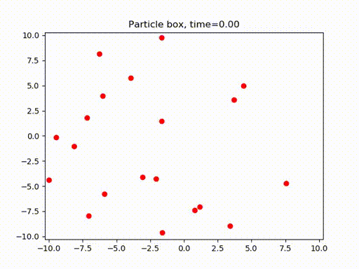
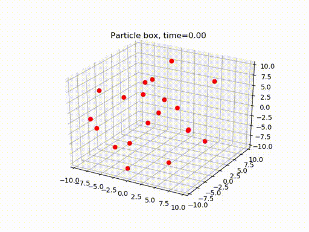

# Basic particle box

Basic particle-in-a-box, optional earth gravity and non-elastic wall collisions. Supports both 2D and 3D simulations. 
Particle-particle collisions not yet implemented.

## Built With

- [Matplotlib](https://matplotlib.org/)
- [Numpy](https://numpy.org/)

 